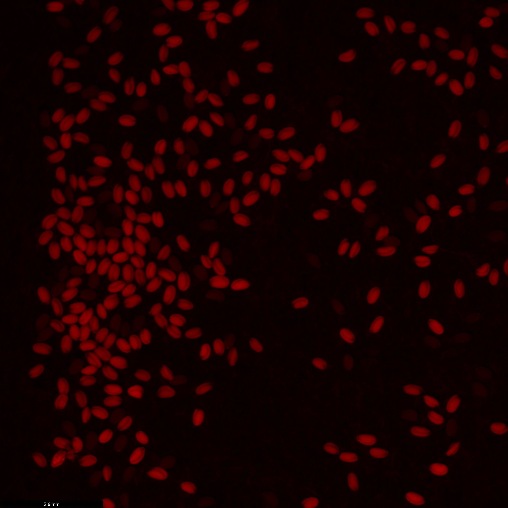
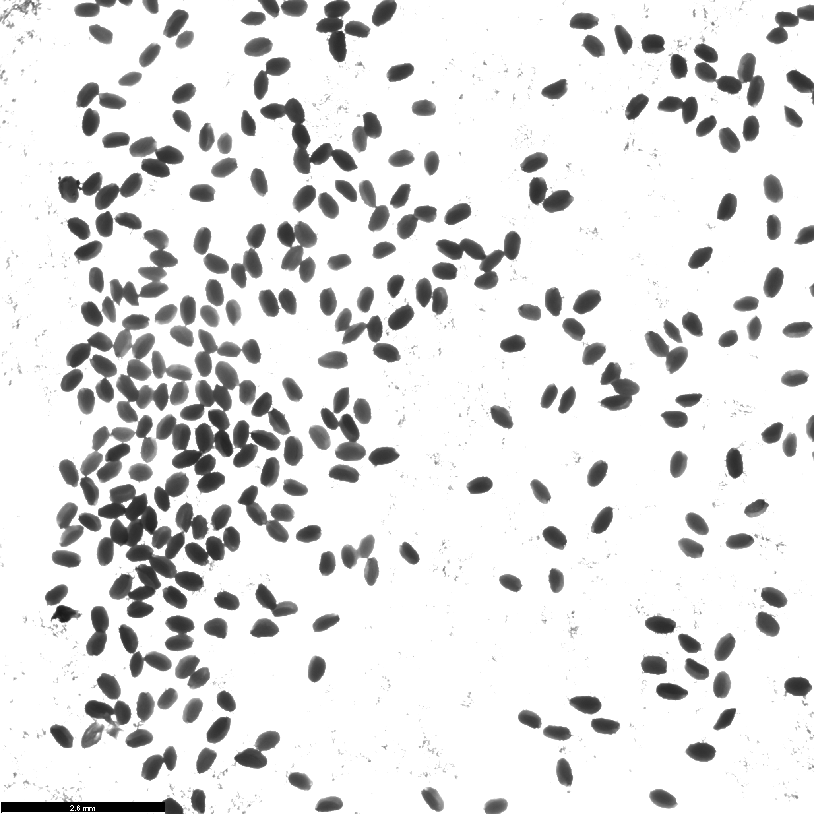
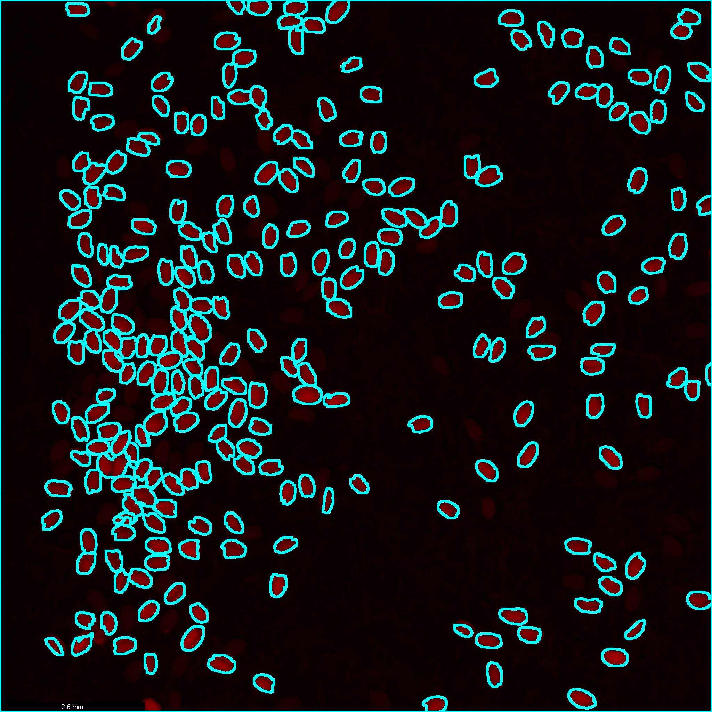
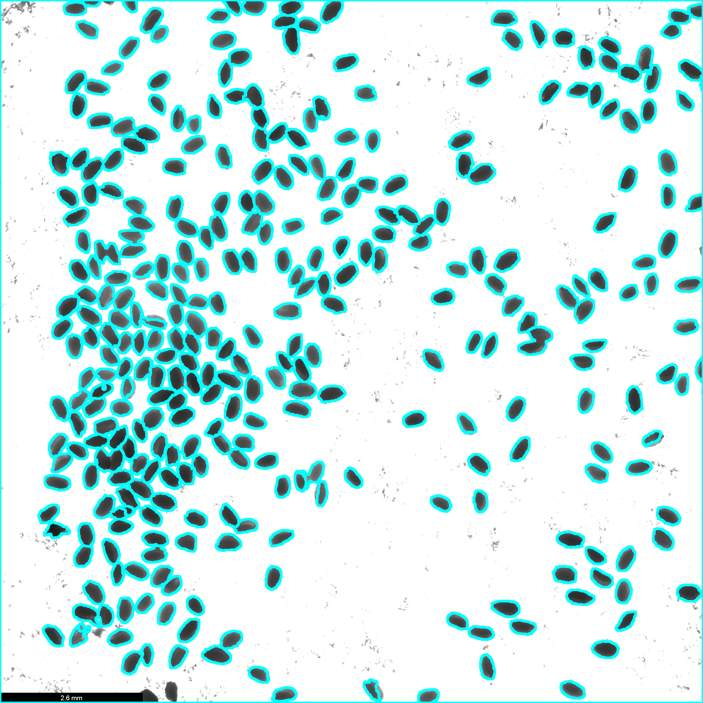

# SeedSeg

[](https://seed-counter-brophy.streamlit.app)

SeedSeg is a tool that counts the number of seeds in an image. This tool was developed for segregation analysis of transgenic Arabidopsis lines to identify lines with a single T-DNA locus, and as such is optimized for counting the number of transgenic seeds expressing a visible marker (fluorescence or pigment) in a mixed pool of seeds with and without the marker.

SeedSeg takes a batch of images as input and outputs in `.csv` format the count of seeds for each input image given.

**Raw Image**
<div style="text-align:center">
    
    
</div>

<br>

**Segmented Image**
<div style="text-align:center">
    
    
</div>

## Getting started
SeedSeg can operate in two modes.

### Fluorescence mode
**Fluorescence mode** requires two images per sample:
- A fluorescence intensity image (grayscale or false color) to count seeds with a fluorescence marker.
- A brightfield image to count the total number of seeds.

These images should be in a directory with the following naming convention:

`<sample>_<image_type>.<extension>`
- `sample`: name/ID for the sample being analyzed, each image pair (fluorescent + brightfield) in the sample should have the same prefix.
- `image_type`: either `FL` (fluorescent image) or `BF` (brightfield image), can be customized using the `--img_type_suffix` parameter.
- `extension`: extension of the image (usually `.tif`).

Example: `VZ254_BF.tif` and `VZ254_FL.tif`

### Colorimetric mode
**Colorimetric mode** requires a single RGB image per sample where transgenic seeds express a marker that displays color visible to the naked eye that is distinct from the color of the wild-type seed. The file name itself is used as the sample name. This is currently optimized for the [RUBY reporter](https://www.nature.com/articles/s41438-020-00390-1).

In colorimetric mode, the RGB image is converted to the CIELAB color space, which expresses color as three values: L for lightness, a for the green-red axis, and b* for the blue-yellow axis. The L value is first used to threshold for all seeds against the background, using a single brightness threshold (either manually set or automatically determined via the triangle algorithm). Then, to identify marker vs non-marker seeds, the b* value is used to distinguish the yellow wild-type seeds which have a high b* value from the red RUBY seeds which have a low b* value using an automatically determined threshold.

## Usage

First, install the required dependencies. Make sure you have at least `Python 3.7`. It is recommended to create a virtual environment first.
```bash
pip install -r requirements.txt
```

After installing requirements, 1) `cd` into the folder containing this repo and 2) make sure that the images are in a directory and in the format and specification specified above. Then, *SeedSeg* can be run with:
```bash
python run.py --dir ./images --output ./output_directory --mode fluorescence --intensity_thresh 30,30
```
- `-d, --dir`: directory with input images with the specified format (required).
- `-o, --output`: output directory to store results (required).
- `-n, --nostore`: flag, if present, does not store the processed images with contours for counting, only the final results in .csv format. Default is `False`.
- `-p, --plot`: flag, if present, plots intermediate steps for each image. Default is `False`.
- `-t, --intensity_thresh`: intensity threshold for calling a pixel as part of a seed. Format is <brightfield_thresh>,<fluorescent_thresh>. Range is from 0 to 255. For `fluorescence` mode, `brightfield_thresh` and `fluorescent_thresh` set the thresholds for the brightfield and fluorescence images respectively. For `colorimetric` mode, only  `brightfield_thresh` is used. If not manually set, the thresholds are automatically calculated from each image using the triangle algorithm. 
- `-r, --radial_thresh`: radial distance threshold for separation of overlapping seeds. Usually ranges from `8.0` to `16.0`. If not manually set, this value is computed automatically from the `radial_threshold_ratio` value. If set, this overrides the `--radial_threshold_ratio` parameter. 
- `--radial_threshold_ratio`: percent of the mean seed radius to use for setting the radial threshold for separation of overlapping seeds. Default is `0.4`, which means that the recognized seed areas are reduced by 40% to separate touching seeds. Range is `0.0` to `1.0`. 
- `--large_area_factor`: factor to filter out objects larger than this multiple of the median seed area. Range is `0` to `100`. This is usually unnecessary for clean images.
- `-s, --img_type_suffix`: suffix for image types in the naming convention, used for `fluorescence` mode. Default is `FL` for fluorescent and `BF` for brightfield images.
- `--mode`: either `fluorescence` (default) or `colorimetric`.

You can get details of all arguments by running:
```bash
python run.py --help
```

### Debugging
In some cases, seeds might not be separated properly or some seeds might be left out from the final result. The following parameters can be tuned to improve the results.

`--intensity_thresh`
- If the seeds are too dim and are not being segmented, try decreasing the threshold (default is `30`).
- If the seeds are bright and there are other shapes in the image being captured, try increasing the threshold.

`--radial_thresh`
- Note: this value usually ranges from `8.0` to `18.0`.
- This parameter has a direct tradeoff between capturing small seeds and separating those that are together. A low value captures small seeds (but doesn't separate very well) and a high value separates well (but leaves out small seeds).
- If there are seeds that are smaller and are not captured, try setting a low value (e.g. `10.0`).
- If there most seeds have the same size and there are many seeds that weren't separated properly, try setting a high value (e.g. `16.0`)

`--radial_threshold_ratio`
- Increase this ratio if seeds are not well separated.
- Decrease it if small seeds are being missed.

`--large_area_factor`
- Lower this value to aggressively remove large clumps or artifacts.
- Increase it if legitimate large seeds are being removed.

## Image Acquisition

You may need to play around with the settings on your microscope to acquire images with the right contrast/brightness (or adjust the intensity_thresh parameter to work with your images). These are the settings used for our lab's Leica Widefield scope to generate the example images, for seeds carrying FAST markers for either RFP or GFP (https://pubmed.ncbi.nlm.nih.gov/19891705/)

- Epifluorescence with mCherry filter: 100 ms exposure (FastRed marker)
- Epifluorescence with GFP filter: 500 ms exposure (FastGreen marker)
- Brightfield with transillumination light: 100 ms exposure, 60% intensity, 50% aperture

With lower exposure (50 ms and 250 ms for FastRed and FastGreen respectively), non-fluorescent seeds only have background levels of signal, and we found that a lower intensity threshold of 20 was both sufficient and necessary.
